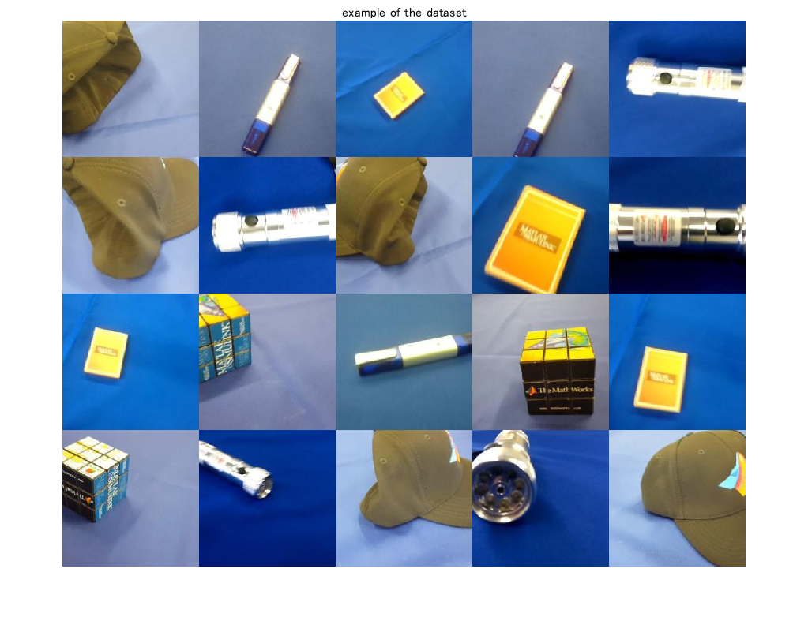

# Dimension reduction and clustering for images 


**[English]**


This demo shows how to perform image clustering and dimension reduction using a pre-trained network. The network has learned rich feature representations for a wide range of images. The feature extraction with the pre-trained network can be utilized for image clustering. 


This demo did


1) loading images and pre-trained network


2) feature extraction with the network 


3) dimension reduction with the extracted features


4) image clustering with k-means algorithm


The illustrations in the thumbnail were obtained from [https://www.irasutoya.com/](https://www.irasutoya.com/)


**[Japanese]**


このデモでは、学習済みの深層学習ネットワークやクラスタリングアルゴリズムを用いて、画像の教師なし分類を行います。MathWorksの`MerchData`を用いて、`resnet-18`による特徴抽出の後に、k-meansアルゴリズムにより分類を行います。


# Preparation

   -  We use a dataset called MearchData provided by Mathworks  
   -  Load a pre-trained network called darknet19 
   -  Load images from the dataset 


```matlab:Code
clear;clc;close all
% unzip the zip file of MearchData
unzip('MerchData.zip');
```


import a pre-trained network called `resnet18`


```matlab:Code
net=resnet18;
% load the images into the image data store called imds
imds = imageDatastore('MerchData','IncludeSubfolders',true,'LabelSource','foldernames');
% use augmented image datastore for image augmentation 
augImds=augmentedImageDatastore(net.Layers(1, 1).InputSize(1:2),imds);
```


Display some images from the dataset


```matlab:Code
% randomly extract image index to display some images 
idx=randperm(numel(imds.Files),20);
% use readByIndex function to read images from the autmented datastore
imgEx=readByIndex(augImds,idx);
% to show the tiled images
figure;montage(imgEx.input);title('example of the dataset')
```





Feature extraction using a pre-trained network


```matlab:Code
% Gather label information from the image datastore
Labels=imds.Labels;
% count the number of images
numClass=numel(countcats(Labels));
% feature extraction with the pre-trained network
feature=squeeze(activations(net,augImds,'fc1000'));
```

# Dimension reduction with Principal component analysis and t-sne

```matlab:Code
figure;
% conduct a principal component analysis for the dimension reduction
A=pca(feature,"Centered",true);
subplot(1,2,1)
gscatter(A(:,1),A(:,2),Labels)
subplot(1,2,2)
% perform t-sne for the dimension reduction
T=tsne(feature');
gscatter(T(:,1),T(:,2),Labels)
```


# Image clustering using k-means after feature extraction with Darknet-19

```matlab:Code
% perform k-means algorithm 
% please note that as the result is dependent on the initial point in the algorithm, the
% result would not be same  
C=kmeans(feature',numClass,"Start","plus");
% confirm the number of images in the largest group 
[~,Frequency] = mode(C);
sz=net.Layers(1, 1).InputSize(1:2);
% prepare a matrix to show the clustering result
I=zeros(sz(1)*numClass,sz(2)*Frequency,3,'uint8');
% loop over the class to display images assigned to the group
for i=1:numClass
    % read the images assigned to the group 
    % use the function "find" to find out the index of the i-th group image
    ithGroup=readByIndex(augImds,find(C==i));
    % tile the images extracted above
    I((i-1)*sz(1)+1:i*sz(1),1:sz(2)*numel(find(C==i)),:)=cat(2,ithGroup.input{:});
end
figure;imshow(I);title('result of the image clustering using k-means after feature extraction with darknet19')
```


